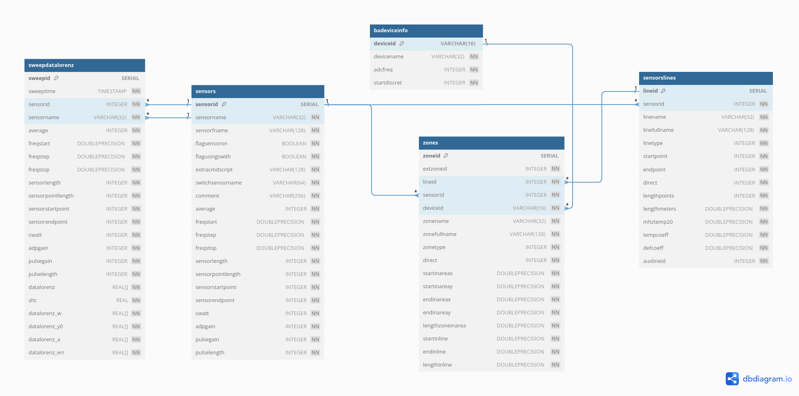

## Quick start

Сгенерируйте файл `main.sql`:

```bash
./mainsql-gen.sh
```

Настройте конфигурации БД в файле`.env`:

```bash
POSTGRES_USER=badatabase
POSTGRES_PASSWORD=<your sec password>
POSTGRES_DB=badatabase
```

Запустите сервер БД используя `docker-compose`:

```bash
docker-compose up
```

## Отчет: Построение защищенных СУБД

@jmpleo @1193221

---

### Описание предметной области

Анализ характеристик оптоволоконного кабеля: бриллюэновский анализатор спектра частот.

### Сущности

- `badeviceinfo` - Конфигурация устройства бриллюэновского анализатора.
- `sensors` - Характеристики сенсора устройства.
- `sensorslines` - Параметры отрезка снятых сенсором характеристик.
- `zones` - Параметры определенной зона на участке линии.
- `sweepdatalorenz` - Непосредственно характеристики (частоты) снятые сенсором. 

### ER-диаграмма



### Ролевая модель безопасности

Роли СУБД: 

- `admin` - Пользователь, имеющий доступ ко всем таблицам на чтение и запись
- `labler` - Разметчик данных линий и зон частотных характеристик. Имеет доступ на чтение и запись таблиц `sensorslines`, `zones`. 
- `viewer` - Обычный пользователь, имеющий доступ на чтение данных в таблицах.

```postgresql
-- Создание роли "admin"
CREATE ROLE admin;
GRANT ALL PRIVILEGES ON ALL TABLES IN SCHEMA public TO admin;
GRANT ALL PRIVILEGES ON ALL SEQUENCES IN SCHEMA public TO admin;

-- Создание роли "labler"
CREATE ROLE labler;
GRANT SELECT, INSERT ON sensorslines TO labler;
GRANT SELECT, INSERT ON zones TO labler;

-- Создание роли "viewer"
CREATE ROLE viewer;
GRANT SELECT ON ALL TABLES IN SCHEMA public TO viewer;
```

### Тщательный контроль доступа (RLS)

Создадим пользователей, для которых будем настраивать разграничение доступа. Предоставим доступ к таблицам разметки `sensorslines` и `zones` в соответствии определенному сенсору.

```postgresql
CREATE USER zones_labler_sensor_1 WITH PASSWORD 'zones_labler_sensor_1';
GRANT zones_labler to zones_labler_sensor_1;

CREATE USER sensorslines_labler_sensor_1 WITH PASSWORD 'sensorslines_labler_sensor_1';
GRANT sensorslines_labler to sensorslines_labler_sensor_1;

CREATE USER auditor_sensor_1 WITH PASSWORD 'auditor_sensor_1';
GRANT auditor to auditor_sensor_1;
```

Теперь настроим политики для пользователей, разграничив выбор для определенных столбцов в зависимости от `sensorid`.

```postgresql
ALTER TABLE sensorslines ENABLE ROW LEVEL SECURITY;
ALTER TABLE zones ENABLE ROW LEVEL SECURITY;

CREATE POLICY view_sensor_1 ON sensorslines FOR
    SELECT TO sensorslines_labler_sensor_1 USING (sensorid = 1);

CREATE POLICY view_sensor_1 ON zones FOR
    SELECT TO zones_labler_sensor_1 USING (sensorid = 1);

CREATE POLICY view_all ON sensorslines FOR
    ALL TO admin USING (TRUE);

CREATE POLICY view_all ON zones FOR
    ALL TO admin USING (TRUE);

CREATE POLICY view_sensor_1 ON sensorslines FOR
    SELECT TO auditor_sensor_1 USING (sensorid = 1);

CREATE POLICY view_sensor_1 ON zones FOR
    SELECT TO auditor_sensor_1 USING (sensorid = 1);
```

### Политика аудита и тщательного аудита FGA

Создадим основные таблицы аудита таблиц разметки, а также триггеры для обработки соответствующих действий.

```postgresql
CREATE TYPE dml_type AS ENUM ('INSERT', 'UPDATE', 'DELETE');

CREATE TABLE IF NOT EXISTS sensorslines_audit_log (
    line_id INTEGER NOT NULL,
    old_row_data JSONB,
    new_row_data JSONB,
    dml_type dml_type NOT NULL,
    dml_timestamp TIMESTAMP NOT NULL,
    dml_created_by VARCHAR(255) NOT NULL,
    PRIMARY KEY (line_id, dml_type, dml_timestamp)
);


CREATE TABLE IF NOT EXISTS zones_audit_log (
    zone_id INTEGER NOT NULL,
    old_row_data JSONB,
    new_row_data JSONB,
    dml_type DML_TYPE NOT NULL,
    dml_timestamp TIMESTAMP NOT NULL,
    dml_created_by VARCHAR(255) NOT NULL,
    PRIMARY KEY (line_id, dml_type, dml_timestamp)
);
```

```postgresql
CREATE OR REPLACE TRIGGER sensorslines_audit_log_trigger
    AFTER
        INSERT OR UPDATE OR DELETE
    ON
        sensorslines
    FOR
        EACH ROW
    EXECUTE FUNCTION
        sensorslines_audit_log_trigger_handle();


CREATE OR REPLACE TRIGGER zones_audit_log_trigger
    AFTER
        INSERT OR UPDATE OR DELETE
    ON
        zones
    FOR
        EACH ROW
    EXECUTE FUNCTION
        zones_audit_log_trigger_handle();
```

Для аудита уровня БД необходимо выставить параметр `log_statement=all` в конфигурационном файле `postgresql.conf`.

Тогда можно бедт наблюдать логирование всех запросов к БД:

```bash
sudo cat /var/log/postgresql/postgresql-<version>-main.log
```

### Контроль целостности

Свзяность таблиц и ограничения, задаваемые в скриптах `entity/*.sql`, обеспечивают декларативный контроль целостности.

Процедурный контроль целостности обеспечивается 
